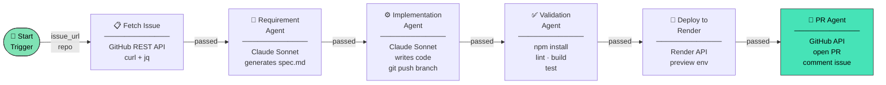
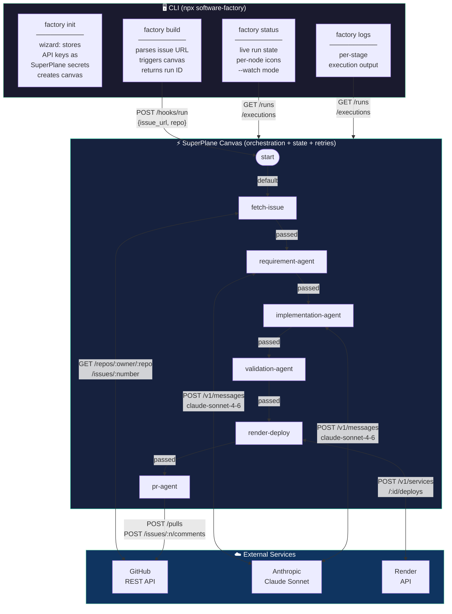
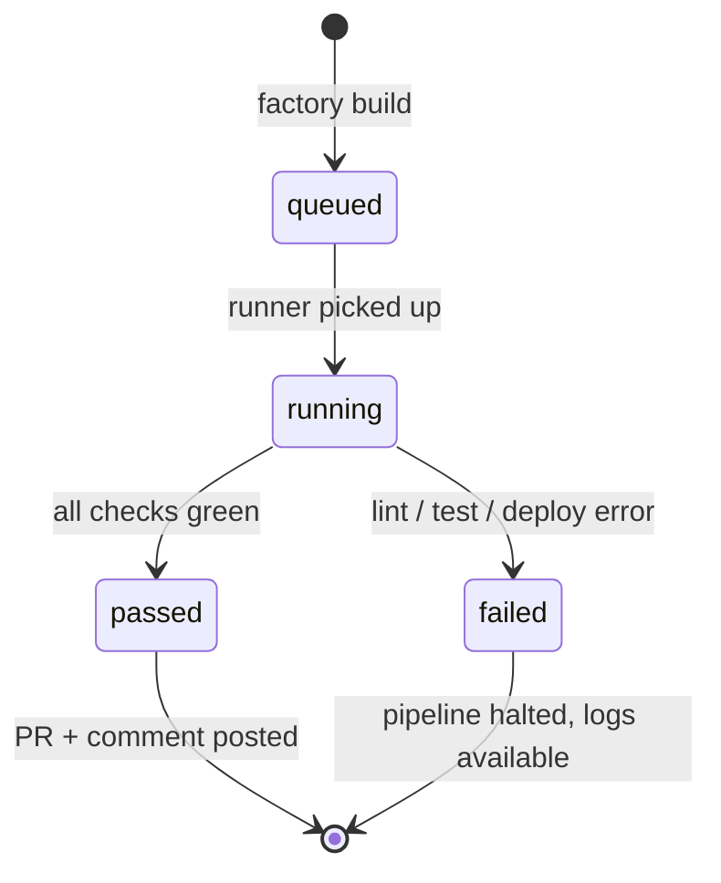
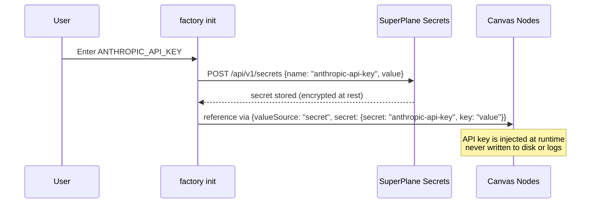
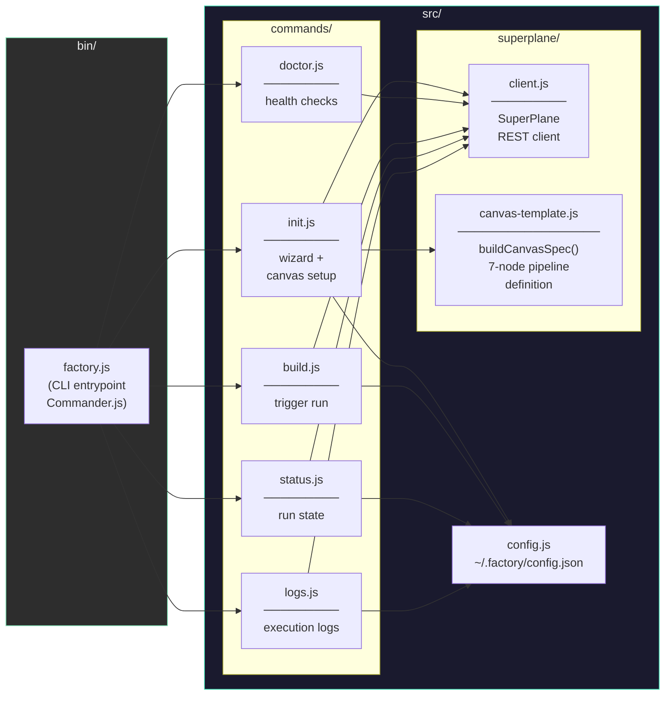

<div align="center">

# 🏭 Software Factory

**Give it a GitHub issue. Wake up to a deployed PoC.**

[](https://www.npmjs.com/package/software-factory)
[](https://www.npmjs.com/package/software-factory)
[](https://github.com/hongchengw/superplane-render-nyc-hack/stargazers)
[](LICENSE)
[](https://nodejs.org)
[](https://superplane.com)
[](https://render.com)

*Autonomous 7-stage pipeline: fetch → spec → code → test → deploy → PR — zero human steps.*

Built at the **SuperPlane Hackathon: Bash Script Funeral /w Render** · NYC, June 27 2026

[**npm package →**](https://www.npmjs.com/package/software-factory) · [**SuperPlane canvas →**](https://app.superplane.com) · [**Demo issues ↓**](#demo-issues)

</div>

---

## Install & Run

```bash
npx software-factory init
npx software-factory build https://github.com/org/repo/issues/42
```

That's it. The factory runs overnight and wakes up with a live preview URL posted to the PR.

> **Available on npm:** [`software-factory`](https://www.npmjs.com/package/software-factory) — install globally with `npm i -g software-factory` or run one-off with `npx software-factory`.

---

## How It Works

```
you:  npx software-factory build https://github.com/org/repo/issues/42

      ╔══════════════════ SuperPlane Canvas ══════════════════╗
      ║                                                        ║
      ║  [1] Fetch Issue      → reads title, body, labels     ║
      ║  [2] Requirement Agent→ Claude writes spec.md         ║
      ║  [3] Implementation   → Claude writes code, pushes    ║
      ║  [4] Validation       → npm install → lint → test     ║
      ║  [5] Deploy to Render → preview env spun up           ║
      ║  [6] PR Agent         → PR opened + issue commented   ║
      ║                                                        ║
      ╚════════════════════════════════════════════════════════╝

      ~8 hours later, you check GitHub:

      PR:      "feat: implement issue #42 [Software Factory]"
      Preview: https://your-service.onrender.com ✅
```

Every stage validates the previous one. If tests fail, the pipeline stops and reports exactly what broke.

---

## Pipeline



---

## Architecture



---

## CLI Commands

```bash
npx software-factory init              # one-time setup wizard
npx software-factory doctor            # verify all prerequisites
npx software-factory build <url>       # trigger the pipeline
npx software-factory status --watch    # live status updates
npx software-factory logs              # per-stage execution output
```

### `init`

Interactive wizard that:
- Prompts for your API keys
- Stores them as **SuperPlane secrets** (encrypted, never written to disk)
- Creates the 7-node canvas on your SuperPlane account
- Saves canvas ID + metadata to `~/.factory/config.json`

### `doctor`

```
  ✔ SuperPlane API          Connected
  ✔ Factory Canvas          "software-factory" (f77c363f...)
  ✔ GitHub Token            Authenticated as @you
  ✔ Render API Key          Render API reachable
  ✔ Secret: anthropic-api-key
  ✔ Secret: github-token
  ✔ Secret: render-api-key
```

### `build <issue-url>`

Accepts any of:

```bash
factory build https://github.com/owner/repo/issues/42
factory build owner/repo#42
factory build https://github.com/owner/repo/issues/42 --repo owner/other-repo
```

### `status --watch`



---

## Setup Requirements

| What | Where to get it | Used by |
|------|----------------|---------|
| **SuperPlane API token** | [app.superplane.com](https://app.superplane.com) → Profile → API Tokens | `factory init` |
| **Anthropic API key** | [console.anthropic.com](https://console.anthropic.com) | Requirement Agent, Implementation Agent |
| **GitHub PAT** | GitHub → Settings → Developer → PATs (`repo` scope) | Fetch Issue, Implementation Agent, PR Agent |
| **Render API key** | [dashboard.render.com](https://dashboard.render.com/u/settings) → API Keys | Deploy to Render |
| **Render Service ID** | Your Render dashboard → the target service | Deploy to Render |

---

## Secrets Model



Your API keys are stored once in SuperPlane's secret store. Each runner node receives them as injected environment variables at execution time.

---

## Codebase



---

## Demo Issues

These are the SuperPlane issues the factory was designed to solve end-to-end:

```bash
factory build https://github.com/superplanehq/superplane/issues/5368   # Markdown view + Mermaid
factory build https://github.com/superplanehq/superplane/issues/5366   # Canvas version diff
factory build https://github.com/superplanehq/superplane/issues/5164   # Send execution to chat
factory build https://github.com/superplanehq/superplane/issues/5704   # Run inspection UX
factory build https://github.com/superplanehq/superplane/issues/5705   # Canvas warnings
```

---

## Contributing

```bash
git clone https://github.com/hongchengw/superplane-render-nyc-hack
cd superplane-render-nyc-hack
npm install
node bin/factory.js --help
```

The pipeline definition lives entirely in [`src/superplane/canvas-template.js`](src/superplane/canvas-template.js). To add a new stage:
1. Add a node object to the `nodes` array
2. Wire it with an edge in the `edges` array
3. Re-run `factory init` (or update an existing canvas via the SuperPlane API)

---

## Star History

<div align="center">

[](https://star-history.com/#hongchengw/superplane-render-nyc-hack&Date)

</div>

---

## License

MIT © [Roshan Sharma](https://github.com/hongchengw)

---

<div align="center">

Built with [SuperPlane](https://superplane.com) · Deployed on [Render](https://render.com) · Models by [Anthropic](https://anthropic.com)

</div>
