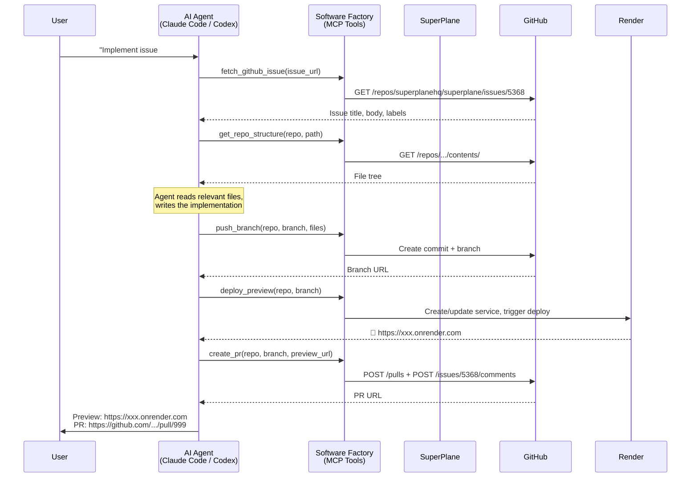
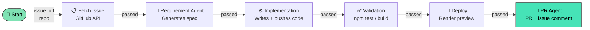
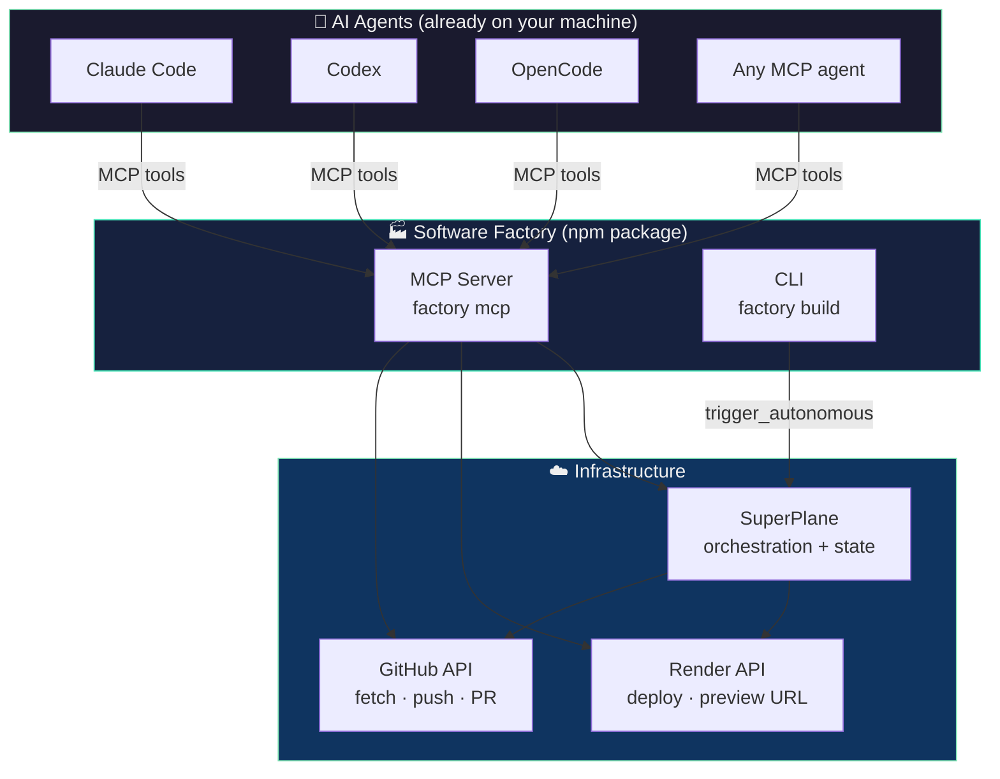
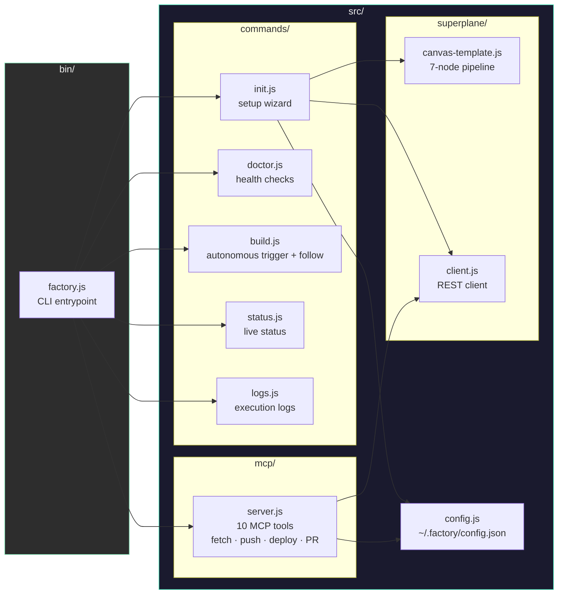

<div align="center">

# 🏭 Software Factory

**Give it a GitHub issue or repo. Get a deployed PoC.**

[](https://www.npmjs.com/package/software-factory)
[](https://www.npmjs.com/package/software-factory)
[](https://github.com/hongchengw/superplane-render-nyc-hack/stargazers)
[](LICENSE)
[](https://nodejs.org)
[](https://superplane.com)
[](https://render.com)

*Your AI coding agent implements the issue. Software Factory deploys it to Render and opens the PR.*

Built at **SuperPlane Hackathon: Bash Script Funeral /w Render** · NYC, June 27 2026

[**npm →**](https://www.npmjs.com/package/software-factory) · [**Demo issues ↓**](#demo-issues)

</div>

---

## What It Does

```
You:     "Implement https://github.com/superplanehq/superplane/issues/5368"

Agent:   fetch_github_issue  → reads the issue
         get_repo_structure  → understands the codebase
         ✍️  writes the implementation (agent's own AI)
         push_branch         → pushes code to GitHub
         deploy_preview      → deploys to Render, returns live URL
         create_pr           → opens PR + comments preview URL on issue

Result:  🚀 Preview: https://factory-issue-5368.onrender.com
         🔀 PR: https://github.com/superplanehq/superplane/pull/999
```

**The AI agent you're already using does the code.** Software Factory handles GitHub, Render, and SuperPlane — no Anthropic key required.

---

## Install

```bash
npm install -g software-factory
# or use directly:
npx software-factory
```

---

## Setup (One Time)

```bash
npx software-factory init
```

You'll be asked for 3 things:

| # | What | Where |
|---|------|-------|
| 1 | **SuperPlane API token** | [app.superplane.com](https://app.superplane.com) → Profile → API Tokens |
| 2 | **GitHub personal access token** | [github.com](https://github.com) → Settings → Developer settings → PATs (`repo` scope) |
| 3 | **Render API key** | [dashboard.render.com/u/settings](https://dashboard.render.com/u/settings) → API Keys |

> **No Anthropic key needed.** Your AI agent (Claude Code, Codex, OpenCode) is already the AI — software-factory is the infrastructure layer.

Or use environment variables for non-interactive setup:
```bash
export SUPERPLANE_TOKEN="TuovNZZl..."
export GITHUB_TOKEN="ghp_..."
export RENDER_API_KEY="rnd_..."

npx software-factory init --yes
```

---

## Using with Your AI Agent

### Claude Code

```bash
# Register as MCP server (one time)
claude mcp add software-factory -- npx software-factory mcp
```

Then in any Claude Code session:
```
Use software-factory MCP tools to implement this issue and deploy it:
https://github.com/superplanehq/superplane/issues/5368

Steps:
1. factory_doctor — verify setup
2. fetch_github_issue — read the issue
3. get_repo_structure — understand the codebase
4. [implement the changes using your own tools]
5. push_branch — push your implementation
6. deploy_preview — get a live Render URL
7. create_pr — open PR + comment the preview URL on the issue
```

### Codex / OpenCode / Any MCP Agent

Add to your agent's MCP config (`.mcp.json` or agent settings):
```json
{
  "mcpServers": {
    "software-factory": {
      "command": "npx",
      "args": ["software-factory", "mcp"]
    }
  }
}
```

Then ask your agent:
```
Use the software-factory tools to build and deploy a PoC for:
https://github.com/superplanehq/superplane/issues/5368
```

---

## MCP Tools Reference

| Tool | Description |
|------|-------------|
| `factory_doctor` | Check setup: SuperPlane, GitHub, Render all connected |
| `fetch_github_issue` | Read issue title, body, labels, comments |
| `get_repo_structure` | List files in a GitHub repo (any path, any branch) |
| `read_repo_file` | Read a specific file from GitHub |
| `push_branch` | Push code files to a new GitHub branch |
| `deploy_preview` | Deploy branch to Render → returns live HTTPS URL |
| `get_deploy_status` | Poll a Render deployment for live status |
| `create_pr` | Open PR + comment preview URL on the original issue |
| `get_pipeline_status` | Check SuperPlane canvas run history |
| `trigger_autonomous_pipeline` | Run the full autonomous pipeline (no agent needed) |

---

## Agent Workflow



---

## CLI Commands

```bash
factory init [--yes]          # One-time setup
factory doctor                # Check configuration
factory build <url> [--follow] # Autonomous pipeline (no agent needed)
factory status [--watch]       # Live pipeline status
factory logs                   # Per-stage execution logs
factory mcp                    # Start MCP server for AI agents
```

### `factory build --follow` (Autonomous Mode)

If you want the pipeline to run fully automatically without an AI agent session:

```bash
factory build https://github.com/superplanehq/superplane/issues/5368 --follow
```

This triggers the SuperPlane canvas which autonomously: fetches the issue → generates spec → writes code → deploys → opens PR. Requires an Anthropic API key stored in secrets (set during `factory init`).



---

## Architecture



---

## Demo Issues

The factory was built to solve these 5 SuperPlane open source issues:

```bash
# In your AI agent:
# "Use software-factory MCP tools to implement and deploy:"

factory build https://github.com/superplanehq/superplane/issues/5368 --follow   # Markdown + Mermaid
factory build https://github.com/superplanehq/superplane/issues/5366 --follow   # Canvas version diff
factory build https://github.com/superplanehq/superplane/issues/5164 --follow   # Send execution to chat
factory build https://github.com/superplanehq/superplane/issues/5704 --follow   # Run inspection UX
factory build https://github.com/superplanehq/superplane/issues/5705 --follow   # Canvas warnings
```

---

## Codebase



---

## Contributing

```bash
git clone https://github.com/hongchengw/superplane-render-nyc-hack
cd superplane-render-nyc-hack
npm install
node bin/factory.js --help
```

---

## Star History

<div align="center">

[](https://star-history.com/#hongchengw/superplane-render-nyc-hack&Date)

</div>

---

## License

MIT © [Roshan Sharma](https://github.com/hongchengw)

---

<div align="center">

Built with [SuperPlane](https://superplane.com) · Deployed on [Render](https://render.com)

</div>
