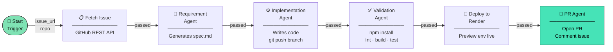
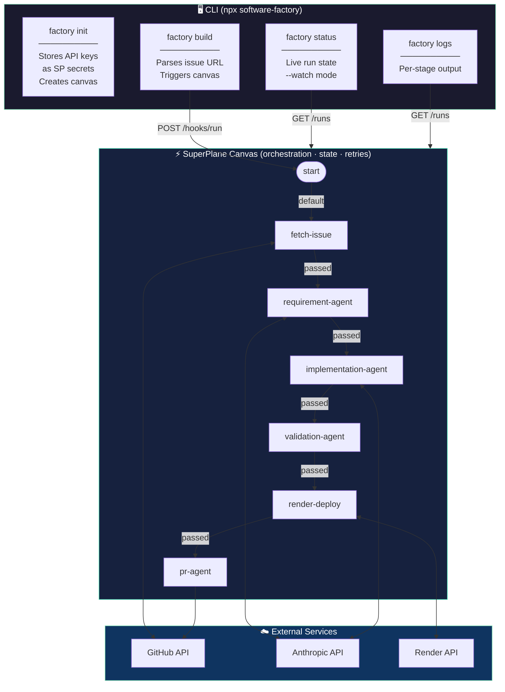
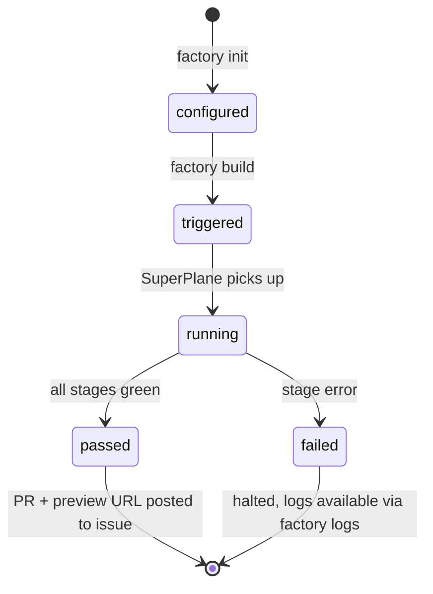
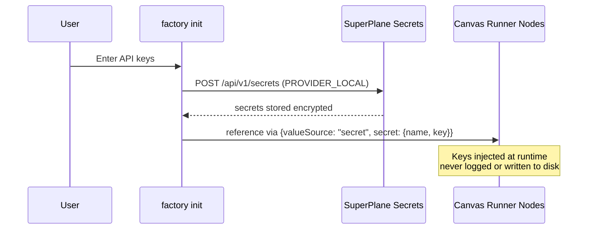
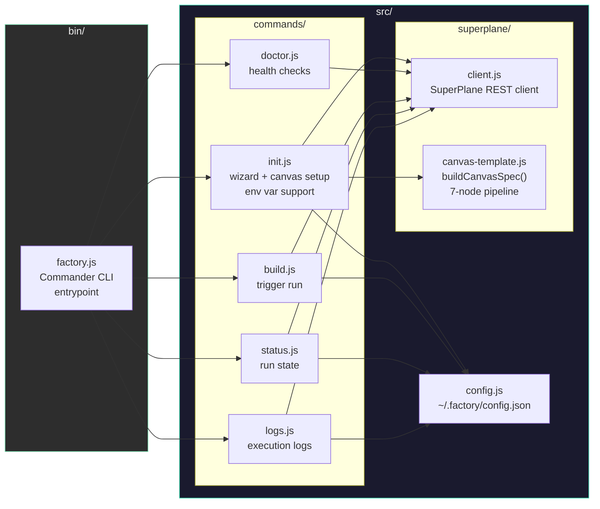

<div align="center">

# 🏭 Software Factory

**Give it a GitHub issue. Wake up to a deployed PoC.**

[](https://www.npmjs.com/package/software-factory)
[](https://www.npmjs.com/package/software-factory)
[](https://github.com/hongchengw/superplane-render-nyc-hack/stargazers)
[](LICENSE)
[](https://nodejs.org)
[](https://superplane.com)
[](https://render.com)

*Autonomous 7-stage pipeline: fetch → spec → code → test → deploy → PR — zero human steps.*

Built at the **SuperPlane Hackathon: Bash Script Funeral /w Render** · NYC, June 27 2026

[**npm →**](https://www.npmjs.com/package/software-factory) · [**SuperPlane canvas →**](https://app.superplane.com) · [**Demo issues ↓**](#demo-issues)

</div>

---

## Quick Start

```bash
npx software-factory init
npx software-factory build https://github.com/owner/repo/issues/42
```

The pipeline runs in SuperPlane overnight. Next morning, a PR with a live Render preview URL is posted to the issue.

---

## How It Works

```
you:  npx software-factory build https://github.com/org/repo/issues/42

      ╔══════════════════ SuperPlane Canvas ══════════════════╗
      ║  [1] Fetch Issue       reads title, body, labels      ║
      ║  [2] Requirement Agent writes a precise spec.md       ║
      ║  [3] Implementation    clones repo, writes code       ║
      ║  [4] Validation        npm install → lint → test      ║
      ║  [5] Deploy to Render  preview environment live       ║
      ║  [6] PR Agent          PR opened + issue commented    ║
      ╚════════════════════════════════════════════════════════╝

      ~8 hours later:
      PR:      "feat: implement issue #42 [Software Factory]"
      Preview: https://your-service.onrender.com ✅
```

---

## Pipeline



---

## Architecture



---

## CLI Commands

```bash
npx software-factory init              # one-time setup wizard
npx software-factory init --yes        # non-interactive (reads env vars)
npx software-factory doctor            # verify all prerequisites
npx software-factory build <url>       # trigger the pipeline
npx software-factory status --watch    # live status updates
npx software-factory logs              # per-stage execution output
```

### `init`

Interactive wizard that:
- Prompts for your API keys (or reads from env vars)
- Stores them as **SuperPlane secrets** (encrypted, never written to disk unencrypted)
- Creates the 7-node canvas on your SuperPlane account
- Saves canvas ID to `~/.factory/config.json`

### `init --yes` (non-interactive)

Reads everything from environment variables — designed for scripted or agent-driven setup:

```bash
export SUPERPLANE_TOKEN="your-token"
export ANTHROPIC_API_KEY="sk-ant-..."
export GITHUB_TOKEN="ghp_..."
export RENDER_API_KEY="rnd_..."          # optional
export RENDER_SERVICE_ID="srv-..."       # optional
export FACTORY_TARGET_REPO="owner/repo" # defaults to superplanehq/superplane

npx software-factory init --yes
```

### `doctor`

```
  ✔ SuperPlane API          Connected as software-factory
  ✔ Factory Canvas          "software-factory" (f77c363f...)
  ✔ GitHub Token            @your-username
  ✔ Render API Key          Render API reachable
  ✔ anthropic-api-key       stored
  ✔ github-token            stored
  ✔ render-api-key          stored
```

### `build <issue-url>`

Accepts any of these formats:

```bash
factory build https://github.com/owner/repo/issues/42
factory build owner/repo#42
factory build https://github.com/owner/repo/issues/42 --repo owner/other-repo
```

---

## Using with AI Coding Agents

Software Factory is designed to be invoked by AI coding agents. Once initialized, a single command kicks off the full overnight pipeline.

### Claude Code

Paste this into your Claude Code session to solve any SuperPlane issue:

```
Use software-factory to implement this issue:
https://github.com/superplanehq/superplane/issues/5368

Steps:
1. Run `factory doctor` — if anything fails, run `factory init`
2. Run `factory build https://github.com/superplanehq/superplane/issues/5368`
3. Run `factory status` to confirm the pipeline started
```

### Codex / OpenCode / any agent

```bash
# One-line setup (if env vars are set):
npx software-factory init --yes

# Solve an issue:
npx software-factory build https://github.com/superplanehq/superplane/issues/5368

# Check progress:
npx software-factory status
```

### State machine



---

## Setup Requirements

| What | Where | Used by |
|------|-------|---------|
| **SuperPlane API token** | [app.superplane.com](https://app.superplane.com) → Profile → API Tokens | `factory init` |
| **Anthropic API key** | [console.anthropic.com](https://console.anthropic.com) | Requirement Agent, Implementation Agent |
| **GitHub PAT** | GitHub → Settings → Developer → PATs (`repo` scope) | Fetch Issue, Implementation, PR Agent |
| **Render API key** | [dashboard.render.com](https://dashboard.render.com/u/settings) → API Keys | Deploy to Render |
| **Render Service ID** | Render dashboard → your service | Deploy to Render |

---

## Secrets Model



---

## Codebase



---

## Demo Issues

The factory was designed to solve these five SuperPlane issues end-to-end:

```bash
factory build https://github.com/superplanehq/superplane/issues/5368   # Markdown view + Mermaid
factory build https://github.com/superplanehq/superplane/issues/5366   # Canvas version diff
factory build https://github.com/superplanehq/superplane/issues/5164   # Send execution to chat
factory build https://github.com/superplanehq/superplane/issues/5704   # Run inspection UX
factory build https://github.com/superplanehq/superplane/issues/5705   # Canvas warnings
```

---

## Contributing

```bash
git clone https://github.com/hongchengw/superplane-render-nyc-hack
cd superplane-render-nyc-hack
npm install
node bin/factory.js --help
```

The pipeline definition lives in [`src/superplane/canvas-template.js`](src/superplane/canvas-template.js). To add a stage: add a node to the `nodes` array, wire it in `edges`, then re-run `factory init`.

---

## Star History

<div align="center">

[](https://star-history.com/#hongchengw/superplane-render-nyc-hack&Date)

</div>

---

## License

MIT © [Roshan Sharma](https://github.com/hongchengw)

---

<div align="center">

Built with [SuperPlane](https://superplane.com) · Deployed on [Render](https://render.com) · Powered by [Anthropic](https://anthropic.com)

</div>
