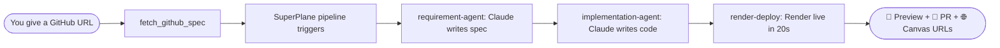
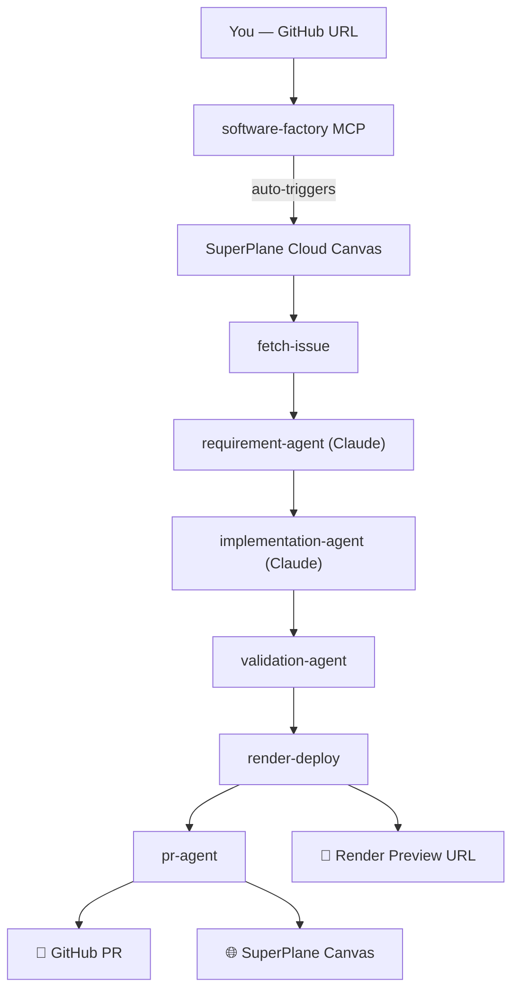
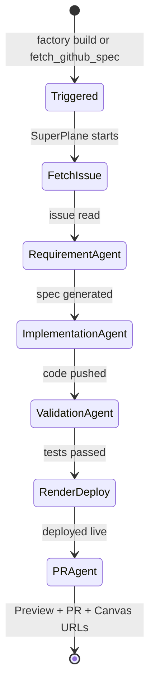

<div align="center">

# 🏭 Software Factory

**Give it a GitHub URL. Get a deployed app + PR — orchestrated by SuperPlane.**

[](https://www.npmjs.com/package/software-factory)
[](https://www.npmjs.com/package/software-factory)
[](https://github.com/hongchengw/superplane-render-nyc-hack/stargazers)
[](LICENSE)
[](https://nodejs.org)
[](https://superplane.com)
[](https://render.com)
[](https://modelcontextprotocol.io)

*Your AI coding agent reads the spec, writes the code, deploys a live preview,*
*opens a PR — all visible live in SuperPlane cloud.*

**Built at SuperPlane Hackathon: Bash Script Funeral /w Render · NYC, June 27 2026**

[npm →](https://www.npmjs.com/package/software-factory) · [GitHub →](https://github.com/hongchengw/superplane-render-nyc-hack) · [Quick Start ↓](#-quick-start)

</div>

---

## What it does

Paste a GitHub URL into any AI agent. The Software Factory MCP tools handle the rest — automatically routing everything through **SuperPlane cloud** so you can watch every stage live:

```
You:       "Use software-factory tools to build: https://github.com/you/myapp/issues/42"

Pipeline:  fetch_github_spec   → reads issue, auto-triggers SuperPlane pipeline
           [SuperPlane cloud]  → requirement-agent: Claude writes spec + Mermaid diagram
           [SuperPlane cloud]  → implementation-agent: Claude writes code, pushes branch
           [SuperPlane cloud]  → validation-agent: npm test / lint / build
           [SuperPlane cloud]  → render-deploy: live on Render in ~20s
           [SuperPlane cloud]  → pr-agent: opens PR + posts preview comment

You get:   🚀 https://factory-myapp.onrender.com
           🔀 https://github.com/you/myapp/pull/42
           🌐 https://app.superplane.com/canvases/<id>
```

**No extra AI key needed in your agent.** Software Factory is the infrastructure layer — SuperPlane + Render + GitHub, wired as 10 MCP tools that auto-orchestrate everything.

---

## 🚀 Quick Start

```bash
npx software-factory init
```

Three prompts, then MCP is auto-registered in Claude Code, Codex, and OpenCode.

```bash
npx software-factory doctor   # verify all connections
```

---

## 📐 How It Works

### End-to-End Flow

[](https://github.com/hongchengw/superplane-render-nyc-hack)

> 💡 **GitHub users:** The diagrams below also render interactively as native Mermaid.



---

### Full Architecture

[](https://github.com/hongchengw/superplane-render-nyc-hack)



---

### Pipeline Stages

[](https://github.com/hongchengw/superplane-render-nyc-hack)



Live terminal output when following a build:

```
⟳ fetch-issue          running...
✔ fetch-issue          3s
⟳ requirement-agent    running...  (Claude writing spec + Mermaid diagram)
✔ requirement-agent    44s
⟳ implementation-agent running...  (Claude writing code + pushing branch)
✔ implementation-agent 2m 18s
⟳ render-deploy        running...
✔ render-deploy        24s
✔ pr-agent             8s

  ━━━━━━━━━━━━━━━━━━━━━━━━━━━━━━━━━━━━━━━━
  ✅  PIPELINE COMPLETE — Share these links:
  ━━━━━━━━━━━━━━━━━━━━━━━━━━━━━━━━━━━━━━━━
  🚀  Preview:    https://factory-myapp.onrender.com
  🔀  PR:         https://github.com/owner/repo/pull/42
  🌐  SuperPlane: https://app.superplane.com/canvases/<id>
  ━━━━━━━━━━━━━━━━━━━━━━━━━━━━━━━━━━━━━━━━

✔ Done in 4m 37s
```

---

## 🔌 SuperPlane & Render — Integration Details

### 🌌 SuperPlane: Orchestration Engine

SuperPlane is the **brain** of the factory — it runs the entire pipeline in cloud-hosted, dockerised environments:

| What SuperPlane does | Details |
|---|---|
| **Visual Canvas** | Watch every stage run live in the UI — no black box |
| **Agent Orchestration** | Connects Claude Sonnet to bash runners for spec, code, validation |
| **Secret Vault** | Encrypts GitHub Token, Render key, Anthropic key org-wide |
| **Canvas Auto-Sync** | `factory init` always updates the remote canvas to the latest spec |
| **Event Triggering** | `fetch_github_spec` → auto-fires pipeline; visible immediately in canvas |

### ⚡ Render: Instant Preview Hosting

Render provides **zero-config, always-on preview environments**:

| What Render does | Details |
|---|---|
| **Auto-Provisioning** | First build for a repo → creates `factory-{repo}` static site automatically |
| **Fast Redeploys** | Repeat builds update branch + redeploy in ~20s |
| **PR Previews** | Each PR gets its own `factory-{repo}-pr-{N}.onrender.com` URL |
| **Root Mapping** | Serves `poc/public/` — isolated from the rest of your source |
| **URL Feedback** | Preview URL is returned to SuperPlane, embedded in PR body + issue comment |

---

## 🛠 Setup (One Time)

### Step 1 — Install & configure

```bash
npx software-factory init
```

You'll be asked for **3 things**:

| # | What | Where to get it |
|---|------|-----------------|
| 1 | **SuperPlane API token** | [app.superplane.com](https://app.superplane.com) → Profile → API Tokens |
| 2 | **GitHub personal access token** | [github.com](https://github.com) → Settings → Developer → PATs (`repo` scope) |
| 3 | **Render API key** | [dashboard.render.com/u/settings](https://dashboard.render.com/u/settings) → API Keys |

> **No Anthropic key needed in your agent** — keys live in SuperPlane's vault and are injected into pipeline nodes automatically.

After entering keys, init automatically:
- Stores all secrets encrypted in SuperPlane
- Creates (or refreshes) the pipeline canvas in SuperPlane
- Registers `software-factory` in **Claude Code** (`claude mcp add software-factory`)
- Writes `~/.mcp.json` for **Codex / OpenCode / any MCP agent**

### Step 2 — Verify

```bash
npx software-factory doctor
```

```
🏥 Software Factory Doctor

  ✔ SuperPlane API    Connected as you
  ✔ Factory Canvas    "software-factory" (a414dc62…)
     🌐 https://app.superplane.com/canvases/a414dc62-...
  ✔ GitHub Token      @yourgithub
  ✔ Render API Key    Render API reachable
  ✔ anthropic-api-key stored
  ✔ github-token      stored
  ✔ render-api-key    stored

  ✅ All systems operational! End-to-end workflow:

  1. Give the agent a GitHub issue/repo URL
  2. fetch_github_spec → auto-triggers SuperPlane pipeline
  3. SuperPlane runs: spec → code → deploy → PR (all visible in cloud)
  4. get_pipeline_status → poll until complete
  5. Report 🚀 Preview URL + 🔀 PR URL + 🌐 Canvas URL to user
```

---

## 🤖 Using with Your AI Agent

Open Claude Code, Codex, or OpenCode (MCP is already registered). Paste this:

```
Use the software-factory tools to build and deploy this:
https://github.com/owner/repo/issues/42
```

The URL can be:

| URL type | Example | What happens |
|----------|---------|--------------|
| **Issue** | `https://github.com/you/myapp/issues/42` | Reads issue → auto-triggers pipeline |
| **Repo** | `https://github.com/you/myapp` | Reads `SPEC.md` / `README.md` → triggers pipeline |
| **File** | `https://github.com/you/myapp/blob/main/SPEC.md` | Reads that file → triggers pipeline |

The agent always gets back **three links** when the pipeline finishes:

```
🚀 Preview:    https://factory-xyz.onrender.com
🔀 PR:         https://github.com/owner/repo/pull/42
🌐 SuperPlane: https://app.superplane.com/canvases/<canvas-id>
```

---

## 🛠 MCP Tools Reference

| Tool | What it does | SuperPlane visible? |
|------|-------------|---------------------|
| `factory_doctor` | Verify all connections + show canvas URL | — |
| `fetch_github_spec` | Read spec/issue **+ auto-trigger pipeline** | ✅ triggers all 6 stages |
| `trigger_autonomous_pipeline` | Explicitly trigger full pipeline | ✅ all 6 stages |
| `get_pipeline_status` | Poll progress — returns all 3 URLs when done | ✅ live stage data |
| `get_repo_structure` | List files in a GitHub repo | — |
| `read_repo_file` | Read a specific GitHub file | — |
| `push_branch` | Push code to a new branch (manual fallback) | — |
| `deploy_preview` | Deploy to Render → live HTTPS URL (manual fallback) | — |
| `get_deploy_status` | Poll a specific Render deploy | — |
| `create_pr` | Open PR + comment preview URL on issue (manual fallback) | — |

---

## 📋 CLI Reference

```bash
# Setup
npx software-factory init              # One-time setup: keys, canvas, MCP registration
npx software-factory doctor            # Verify all connections

# Run the pipeline
npx software-factory build <url>       # Trigger autonomous pipeline
npx software-factory build <url> --follow  # With live stage-by-stage output

# Monitor
npx software-factory status            # Current pipeline run status
npx software-factory status --watch    # Auto-refresh every 10s
npx software-factory logs              # Per-stage execution logs

# MCP server (called by your agent automatically)
npx software-factory mcp
```

---

## 🤝 Agent Setup Details

### Claude Code

```bash
# Auto-registered by factory init, or manually:
claude mcp add software-factory -- npx software-factory mcp
```

### Codex / OpenCode / Any MCP Agent

`~/.mcp.json` (written automatically by `factory init`):

```json
{
  "mcpServers": {
    "software-factory": {
      "command": "npx",
      "args": ["software-factory", "mcp"]
    }
  }
}
```

---

## 🔑 Environment Variables

```bash
export SUPERPLANE_TOKEN="TuovNZZl..."      # SuperPlane API token
export GITHUB_TOKEN="ghp_..."             # GitHub personal access token
export RENDER_API_KEY="rnd_..."           # Render API key
export RENDER_SERVICE_ID="srv-..."        # Optional: skip service lookup
export FACTORY_TARGET_REPO="owner/repo"  # Default target repo
export FACTORY_CANVAS_ID="uuid"          # SuperPlane canvas ID
```

Non-interactive (CI/CD):
```bash
npx software-factory init --yes
```

---

## 📁 Codebase

```
bin/
  factory.js          CLI entrypoint

src/
  mcp/
    server.js         10 MCP tools (JSON-RPC 2.0 stdio)
  commands/
    init.js           setup + MCP auto-register + canvas sync
    doctor.js         health checks
    build.js          autonomous pipeline trigger + --follow watcher
    status.js         pipeline status
    logs.js           execution logs
  superplane/
    client.js         SuperPlane REST client
    canvas-template.js  6-node pipeline definition
  config.js           ~/.factory/config.json
```

---

## 🌟 Demo — Try It Now

```bash
# Build a feature from a real SuperPlane issue
npx software-factory build https://github.com/superplanehq/superplane/issues/5368 --follow

# Watch all 6 stages complete in your terminal
# Then open the 3 links: Preview · PR · SuperPlane Canvas
```

---

## 🤝 Contributing

```bash
git clone https://github.com/hongchengw/superplane-render-nyc-hack
cd superplane-render-nyc-hack
npm install
node bin/factory.js --help
```

---

<div align="center">

Built with [SuperPlane](https://superplane.com) · Deployed on [Render](https://render.com)

MIT © [Roshan Sharma](https://github.com/roshaninfordham), [Hong Cheng Wang](https://github.com/hongchengw), [Berton Yeh](https://github.com/berber54)

</div>
