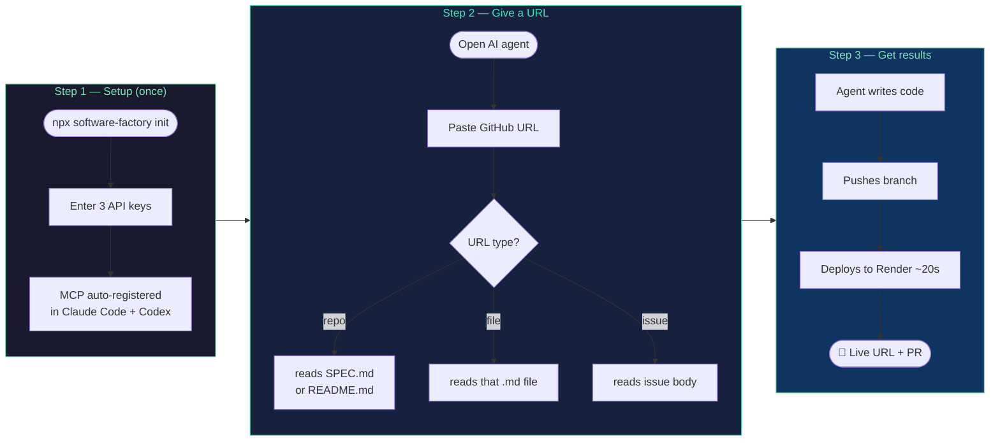
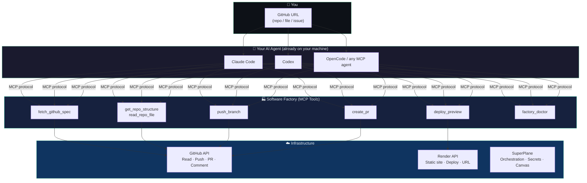
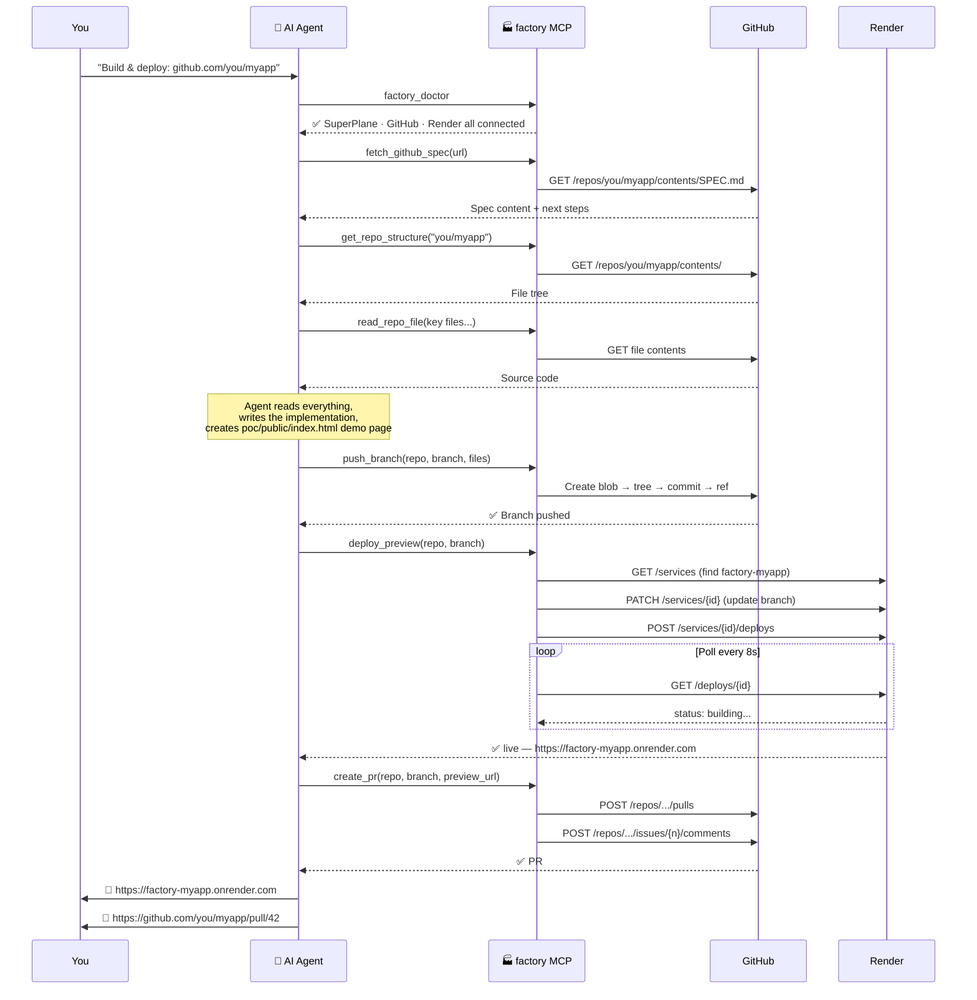
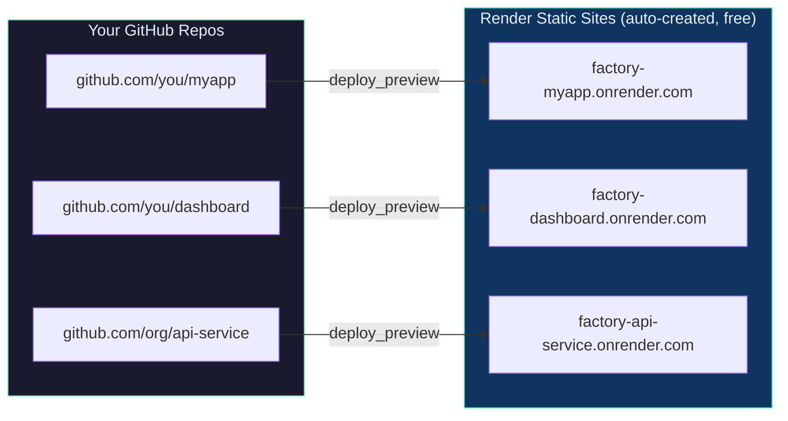
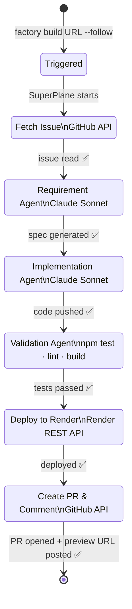
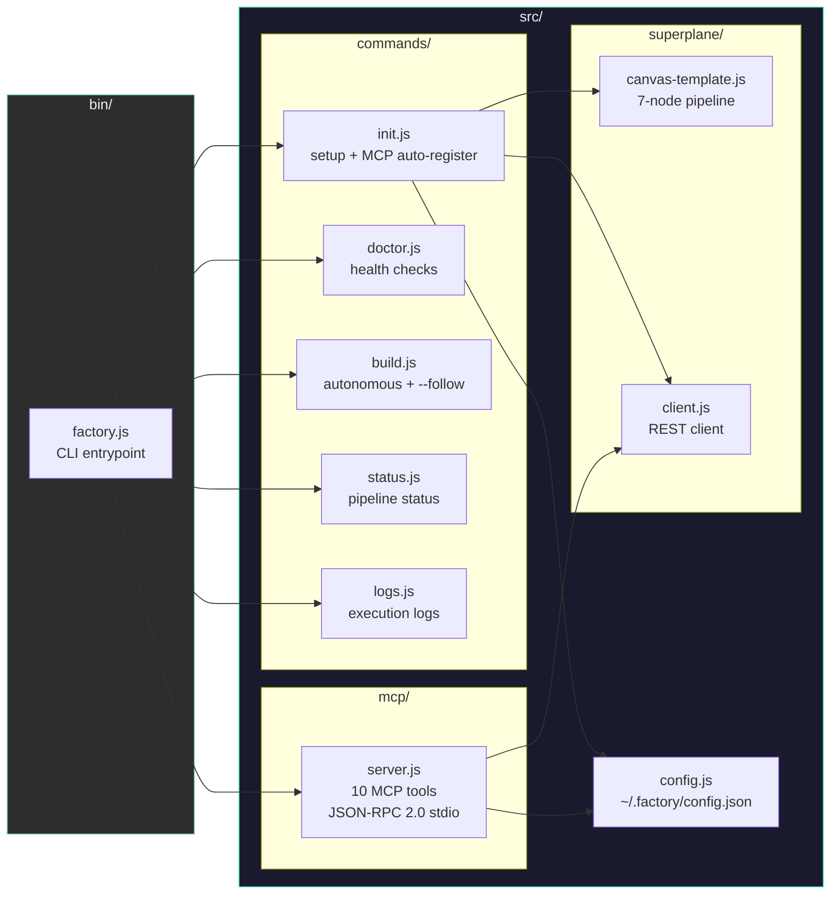
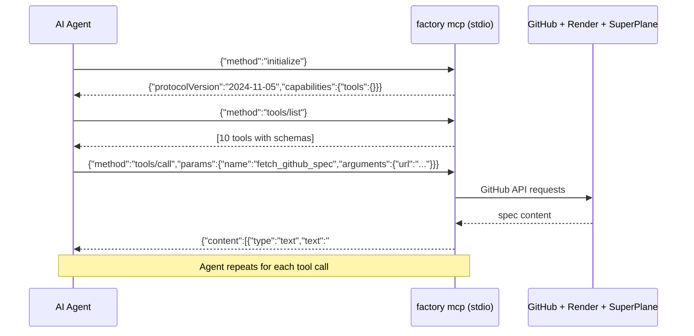

<div align="center">

# 🏭 Software Factory

**Give it a GitHub URL. Get a deployed app + PR.**

[](https://www.npmjs.com/package/software-factory)
[](https://www.npmjs.com/package/software-factory)
[](https://github.com/hongchengw/superplane-render-nyc-hack/stargazers)
[](LICENSE)
[](https://nodejs.org)
[](https://superplane.com)
[](https://render.com)

*Your AI coding agent reads the spec, writes the code, and deploys a live preview — automatically.*

**Built at SuperPlane Hackathon: Bash Script Funeral /w Render · NYC, June 27 2026**

[npm →](https://www.npmjs.com/package/software-factory) · [Live demo ↓](#-live-demo) · [How it works ↓](#-how-it-works)

> 📊 **Mermaid diagrams below render on GitHub.** [View on GitHub](https://github.com/hongchengw/superplane-render-nyc-hack) for the full visual experience.

</div>

---

## What it does

You give it a GitHub URL. Your AI agent does the rest.

```
You:    "Use software-factory tools to build this: https://github.com/you/myapp"

Agent:  fetch_github_spec   → reads SPEC.md (or issue, or any .md file)
        get_repo_structure  → explores the codebase
        [writes the code]   ← agent's own AI does this
        push_branch         → pushes to a new branch
        deploy_preview      → live at https://factory-myapp.onrender.com in ~20s
        create_pr           → opens PR + comments the live URL on the issue

You get:  🚀 https://factory-myapp.onrender.com
          🔀 https://github.com/you/myapp/pull/42
```

**No Anthropic key required.** Your AI agent (Claude Code, Codex, OpenCode) is already the AI. Software Factory is the infrastructure — GitHub + Render + SuperPlane, wired together as MCP tools.

---

## 🚀 Quick Start

```bash
npx software-factory init
```

That's it. Three prompts, then MCP is auto-registered in your AI agent.

---

## 🔌 SuperPlane & Render Integration & Capabilities

The Software Factory is built on a tight, end-to-end integration between **SuperPlane** (for visual canvas orchestration) and **Render** (for instant, serverless web previews).

### 🌌 SuperPlane: Canvas Orchestration & Secrets
SuperPlane serves as the brain and coordinator of the factory:
- **Visual Canvas Interface**: Displays the progress of your pipeline live. You can watch each stage (`fetch-issue` → `requirement-agent` → `implementation-agent` → `validation-agent` → `render-deploy` → `pr-agent`) complete in real-time.
- **Agent Orchestration**: Connects Claude/GPT directly into bash runners to fetch specs, refactor/generate code, build the POC, and validate everything inside clean dockerized environments.
- **Secure Secret Manager**: Encrypts and stores your GitHub Token and Render API Key organization-wide. Agents running inside SuperPlane fetch these keys securely without exposing them.
- **Spec Updates**: Automatically updates canvas blueprints from your CLI template definitions, ensuring your remote pipeline always matches the latest local updates.

### ⚡ Render: Autonomous Deploys & Previews
Render acts as the instant hosting and preview engine for every PoC created:
- **Instant Static Provisioning**: The first time you run a build for a repository, Render dynamically provisions a free static site mapping to your target branch.
- **Redeployment in Seconds**: On repeat builds, Render updates the branch mapping and triggers an active static build instantly (~20s redeploys).
- **Clean Root Mapping**: Serves static pages specifically from the `poc/public/` directory, isolating the hosted environment from the rest of your source code.
- **Direct Preview Feedback**: Returns the live HTTPS URL back to the canvas runner, allowing it to be commented back on the original GitHub issue and PR.

### 🏆 Capabilities & Features
- **True Autonomous End-to-End Execution**: paste one GitHub issue URL and watch SuperPlane complete the entire requirement-to-PR cycle autonomously.
- **Agent-First MCP Integration**: lets your local AI agent (Claude Code, OpenCode, Codex) leverage these backend primitives step-by-step.
- **Dynamic Mermaid Diagram Visualizations**: automatically generates architectural/system design diagrams in your specifications, embeds them interactively inside the hosted POC pages, and links them directly inside GitHub PR descriptions.

---

## 📐 How it works

### The 3-step journey



---

### Architecture



---

### Agent workflow (sequence)



---

## 🛠 Setup (One Time)

### Step 1 — Install & configure

```bash
npx software-factory init
```

You'll be asked for **3 things**:

| # | What | Where to get it |
|---|------|-----------------|
| 1 | **SuperPlane API token** | [app.superplane.com](https://app.superplane.com) → Profile → API Tokens |
| 2 | **GitHub personal access token** | [github.com](https://github.com) → Settings → Developer → PATs (`repo` scope) |
| 3 | **Render API key** | [dashboard.render.com/u/settings](https://dashboard.render.com/u/settings) → API Keys |

> **No Anthropic key needed.** Your AI agent is already the AI.

After entering keys, init automatically:
- Stores all secrets in SuperPlane (encrypted)
- Creates the pipeline canvas in SuperPlane
- Registers `software-factory` in **Claude Code** (`claude mcp add software-factory`)
- Writes `~/.mcp.json` for **Codex / OpenCode / any MCP agent**

### Step 2 — Verify

```bash
npx software-factory doctor
```

```
✅ SuperPlane    Connected as you
✅ Canvas        "software-factory" (95af5949…)
✅ GitHub        @yourgithub
✅ Render        Connected
✅ Live Service  https://software-factory-poc.onrender.com

✅ Ready! Give me a GitHub URL:
  • Repo with spec:  https://github.com/owner/repo
  • Specific file:   https://github.com/owner/repo/blob/main/SPEC.md
  • Issue to fix:    https://github.com/owner/repo/issues/42
```

---

## 🤖 Using with Your AI Agent

Open Claude Code, Codex, or OpenCode. The MCP is already registered. Paste this:

```
Use the software-factory tools to build and deploy this:
https://github.com/owner/repo
```

The URL can be:

| URL type | Example | What happens |
|----------|---------|--------------|
| **Repo** | `https://github.com/you/myapp` | Reads `SPEC.md`, `spec.md`, `PROMPT.md`, or `README.md` |
| **File** | `https://github.com/you/myapp/blob/main/SPEC.md` | Reads that exact file |
| **Issue** | `https://github.com/you/myapp/issues/42` | Reads the issue title + body + comments |

### MCP Tools Reference

| Tool | What it does |
|------|-------------|
| `factory_doctor` | Verify SuperPlane + GitHub + Render are all connected |
| `fetch_github_spec` | Read spec/issue from any GitHub URL |
| `get_repo_structure` | List files/dirs in a GitHub repo |
| `read_repo_file` | Read a specific file from GitHub |
| `push_branch` | Push code + demo page to a new branch |
| `deploy_preview` | Deploy to Render → returns live HTTPS URL (~20s) |
| `get_deploy_status` | Poll a Render deployment for status |
| `create_pr` | Open PR + comment preview URL on the issue |
| `get_pipeline_status` | Check SuperPlane canvas run history |
| `trigger_autonomous_pipeline` | Run full pipeline without an agent (needs Anthropic key) |

---

## 📊 Deploy Pipeline

```mermaid
flowchart LR
    A([🌐 GitHub URL]) -->|fetch_github_spec| B
    B["📋 Read Spec\nSPEC.md · issue · file"] -->|get_repo_structure| C
    C["🗂 Explore Codebase\nread key files"] -->|agent writes code| D
    D["✍️ Implement\ncode + tests + demo page"] -->|push_branch| E
    E["📤 Push Branch\nGitHub API"] -->|deploy_preview| F
    F["🚢 Deploy\nRender static site"] -->|create_pr| G
    G(["🚀 Live URL\n+ PR + issue comment"])

    style A fill:#7fe2b4,stroke:#333,color:#000
    style G fill:#46E3B7,stroke:#333,color:#000
    style D fill:#2d333b,color:#e6edf3,stroke:#58a6ff
```



---

## 🏗 Deployment Architecture

Each GitHub repo gets its **own Render static site** — unique URL, auto-created on first deploy:



- First deploy for a repo: creates `factory-{reponame}` service (~30s)
- Repeat deploys: updates branch + redeploys (~20s)
- PR previews enabled: each PR gets `factory-{repo}-pr-{N}.onrender.com`

---

## ⚙️ Autonomous Mode (No Agent Needed)

If you don't want to use an AI agent, the SuperPlane pipeline runs everything automatically:

```bash
npx software-factory build https://github.com/owner/repo/issues/42 --follow
```

**Requires:** Anthropic API key (set during `factory init`).



```
⟳ fetch-issue          running...
✔ fetch-issue          3s
⟳ requirement-agent    running...
✔ requirement-agent    44s
⟳ implementation-agent running...
✔ implementation-agent 2m 18s
⟳ render-deploy        running...
✔ render-deploy        24s
✔ pr-agent             8s

🚀 Preview: https://factory-myapp.onrender.com
🔀 PR: https://github.com/owner/repo/pull/42
✅ Done in 4m 37s
```

---

## 📁 Codebase



---

## 📋 CLI Reference

```bash
npx software-factory init           # One-time setup — keys, canvas, MCP registration
npx software-factory doctor         # Verify all connections
npx software-factory build <url>    # Autonomous pipeline (no agent needed)
npx software-factory build <url> --follow  # With live stage-by-stage output
npx software-factory status         # Current pipeline run status
npx software-factory status --watch # Auto-refresh every 10s
npx software-factory logs           # Per-stage execution logs
npx software-factory mcp            # Start MCP server (called by your agent)
```

---

## 🤝 Agent Setup Details

### Claude Code

```bash
# Auto-registered by factory init, or manually:
claude mcp add software-factory -- npx software-factory mcp
```

Then in any Claude Code session:
```
Use software-factory MCP tools to build and deploy:
https://github.com/owner/repo
```

### Codex / OpenCode / Any MCP Agent

`~/.mcp.json` is written automatically by `factory init`:

```json
{
  "mcpServers": {
    "software-factory": {
      "command": "npx",
      "args": ["software-factory", "mcp"]
    }
  }
}
```

Or add this to your agent's config file manually.

---

## 🔑 Environment Variables

```bash
export SUPERPLANE_TOKEN="TuovNZZl..."      # SuperPlane API token
export GITHUB_TOKEN="ghp_..."              # GitHub personal access token
export RENDER_API_KEY="rnd_..."            # Render API key
export RENDER_SERVICE_ID="srv-..."         # Optional: skip service lookup
export FACTORY_TARGET_REPO="owner/repo"   # Default target repo
export FACTORY_CANVAS_ID="uuid"           # SuperPlane canvas ID
```

Non-interactive setup (CI/CD):
```bash
npx software-factory init --yes
```

---

## 🧩 How the MCP Protocol Works



The MCP server runs as a subprocess via stdio (JSON-RPC 2.0). Your AI agent manages the process — no background daemon needed.

---

## 🌟 Demo — SuperPlane Open Issues

These are the 5 SuperPlane issues the factory was built to solve:

```bash
# Markdown + Mermaid view mode
npx software-factory build https://github.com/superplanehq/superplane/issues/5368 --follow

# Canvas version diff
npx software-factory build https://github.com/superplanehq/superplane/issues/5366 --follow

# Send execution to chat
npx software-factory build https://github.com/superplanehq/superplane/issues/5164 --follow

# Run inspection UX
npx software-factory build https://github.com/superplanehq/superplane/issues/5704 --follow

# Canvas warnings
npx software-factory build https://github.com/superplanehq/superplane/issues/5705 --follow
```

---

## 🤝 Contributing

```bash
git clone https://github.com/hongchengw/superplane-render-nyc-hack
cd superplane-render-nyc-hack
npm install
node bin/factory.js --help
```

---

<div align="center">

Built with [SuperPlane](https://superplane.com) · Deployed on [Render](https://render.com)

MIT © [Roshan Sharma](https://github.com/roshaninfordham)

</div>
